# CorrectAI — Architecture Logicielle

> Document d'architecture généré à partir de l'implémentation existante du projet CorrectAI.
> Convient pour une inclusion dans un rapport de Projet de Fin d'Études (PFE).

---

## Table des matières

1. [Architecture Globale](#1-architecture-globale)
2. [Structure du Projet](#2-structure-du-projet)
3. [Diagramme de Cas d'Utilisation UML](#3-diagramme-de-cas-dutilisation-uml)
4. [Diagramme de Classes UML](#4-diagramme-de-classes-uml)
5. [Diagrammes de Séquence](#5-diagrammes-de-séquence)
6. [Diagrammes d'Activité](#6-diagrammes-dactivité)
7. [Diagramme de Composants](#7-diagramme-de-composants)
8. [Diagramme de Paquetages](#8-diagramme-de-paquetages)
9. [Diagramme de Déploiement](#9-diagramme-de-déploiement)
10. [Code Mermaid Complet](#10-code-mermaid-complet)

---

## 1. Architecture Globale

### Description

CorrectAI est une application mobile cross-platform (iOS, Android, Web) développée avec React Native et Expo SDK 56. L'architecture suit un modèle **monolithique à base de composants** où l'ensemble de l'état, de la logique métier et de l'interface utilisateur réside dans une seule application cliente. Il n'y a pas de backend distant actuellement — toutes les données sont stockées en mémoire via des données mockées.

L'application implémente un **routeur personnalisé** basé sur un état `useState<AppScreen>` avec un `switch` géant plutôt que d'utiliser le routage fichier complet d'Expo Router. La navigation est donc **programmatique et centralisée** dans le composant racine `CorrectAiApp`.

### Couches de l'Application

```
┌─────────────────────────────────────────────────────────────┐
│                    COUCHE PRÉSENTATION                       │
│  Screens (Auth, Admin, SuperAdmin, Professor, Student)      │
│  Composants UI (Card, Field, PrimaryButton, ScreenFrame...) │
│  Composants métier (ExamRow, PersonRow, Avatar...)          │
├─────────────────────────────────────────────────────────────┤
│                    COUCHE NAVIGATION                         │
│  CorrectAiApp (switch useAppScreen)                         │
│  Props drilling (onNavigate, onUpdate*, data)               │
├─────────────────────────────────────────────────────────────┤
│                    COUCHE LOGIQUE MÉTIER                     │
│  Callbacks CRUD (create*, update*, delete*)                 │
│  Utilitaires (buildCopyCorrectionSummary, resolveQuestionBank)│
│  Validation (validateExamForm, validateStudentForm)         │
├─────────────────────────────────────────────────────────────┤
│                    COUCHE DONNÉES                            │
│  Mock data (mock-data.ts)                                   │
│  useState / useMemo (CorrectAiApp.tsx)                      │
│  Clonage immuable (cloneExam, cloneScannedCopy)             │
├─────────────────────────────────────────────────────────────┤
│                    COUCHE THÈME                              │
│  correctAiTheme (couleurs, radius, spacing)                 │
│  Theme système (light/dark)                                  │
├─────────────────────────────────────────────────────────────┤
│                    FONCTIONNALITÉS SPÉCIFIQUES               │
│  Scan (expo-camera, alignement simulé)                      │
│  Impression (expo-print, react-native-view-shot)            │
│  Export PDF (expo-print, expo-file-system, expo-sharing)    │
└─────────────────────────────────────────────────────────────┘
```

### Diagramme d'Architecture Globale

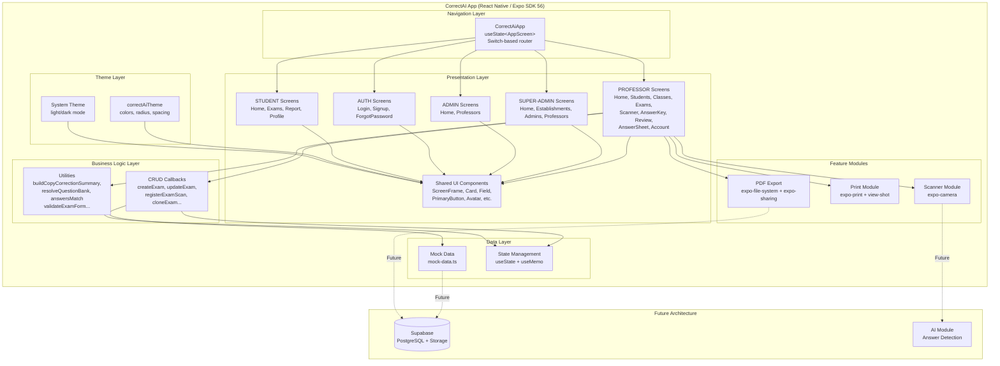
```mermaid
graph TB
    subgraph "CorrectAI App (React Native / Expo SDK 56)"
        direction TB

        subgraph "Presentation Layer"
            AS[AUTH Screens<br/>Login, Signup, ForgotPassword]
            SS[SUPER-ADMIN Screens<br/>Home, Establishments, Admins, Professors]
            ADS[ADMIN Screens<br/>Home, Professors]
            PS[PROFESSOR Screens<br/>Home, Students, Classes, Exams,<br/>Scanner, AnswerKey, Review,<br/>AnswerSheet, Account]
            STS[STUDENT Screens<br/>Home, Exams, Report, Profile]
            UI[Shared UI Components<br/>ScreenFrame, Card, Field,<br/>PrimaryButton, Avatar, etc.]
        end

        subgraph "Navigation Layer"
            NAV[CorrectAiApp<br/>useState&lt;AppScreen&gt;<br/>Switch-based router]
        end

        subgraph "Business Logic Layer"
            CRUD[CRUD Callbacks<br/>createExam, updateExam,<br/>registerExamScan, cloneExam...]
            UTILS[Utilities<br/>buildCopyCorrectionSummary,<br/>resolveQuestionBank, answersMatch<br/>validateExamForm...]
        end

        subgraph "Data Layer"
            MOCK[Mock Data<br/>mock-data.ts]
            STATE[State Management<br/>useState + useMemo]
        end

        subgraph "Theme Layer"
            THEME[correctAiTheme<br/>colors, radius, spacing]
            SYSTHEME[System Theme<br/>light/dark mode]
        end

        subgraph "Feature Modules"
            SCANNER[Scanner Module<br/>expo-camera]
            PRINT[Print Module<br/>expo-print + view-shot]
            PDF[PDF Export<br/>expo-file-system + expo-sharing]
        end
    end

    subgraph "Future Architecture"
        SUPABASE[(Supabase<br/>PostgreSQL + Storage)]
        AI[AI Module<br/>Answer Detection]
    end

    NAV --> AS
    NAV --> SS
    NAV --> ADS
    NAV --> PS
    NAV --> STS
    PS --> UI
    SS --> UI
    ADS --> UI
    AS --> UI
    STS --> UI

    CRUD --> MOCK
    CRUD --> STATE
    UTILS --> STATE
    PS --> CRUD
    PS --> UTILS

    PS --> SCANNER
    PS --> PRINT
    PS --> PDF

    THEME --> UI
    SYSTHEME --> UI

    MOCK -.->|Future| SUPABASE
    SCANNER -.->|Future| AI
    PDF -.->|Future| SUPABASE
```

**Explication académique :**

L'architecture de CorrectAI est une architecture **monolithique à deux niveaux** (présentation et logique métier) avec un couplage fort entre les composants via le passage de props. Le composant racine `CorrectAiApp` agit comme un **contrôleur central** qui gère l'état global, les opérations CRUD, et le routage. Chaque écran reçoit ses données et callbacks via des props, suivant le pattern **Props Drilling**. Cette approche, bien que simple et adaptée à un projet de cette taille, pourrait bénéficier à terme de l'introduction d'un contexte React ou d'une bibliothèque de gestion d'état pour réduire la complexité du composant racine.

---

## 2. Structure du Projet

### Arborescence Complète

```
CorrectAi/
├── app.json                          # Configuration Expo
├── package.json                      # Dépendances et scripts
├── tsconfig.json                     # Configuration TypeScript
├── AGENTS.md                         # Instructions pour l'IA
├── CLAUDE.md                         # Instructions pour Claude
├── eslint.config.js                  # Configuration ESLint
├── global.d.ts                       # Déclarations globales TypeScript
├── assets/
│   ├── images/
│   │   ├── correctai-splash-logo.png # Logo CorrectAI
│   │   ├── icon.png                  # Icône de l'application
│   │   ├── logo-glow.png             # Logo animé
│   │   ├── expo-logo.png             # Logo Expo
│   │   ├── splash-icon.png           # Icône de démarrage
│   │   ├── tabIcons/                 # Icônes de la barre d'onglets
│   │   ├── android-icon-*.png        # Icônes adaptatives Android
│   │   └── favicon.png               # Favicon Web
│   └── expo.icon/                    # Catalogue d'icônes iOS
├── scripts/
│   └── reset-project.js              # Script de réinitialisation
└── src/
    ├── global.css                    # Styles CSS globaux (Web)
    ├── app/
    │   ├── _layout.tsx               # Layout racine Expo Router
    │   ├── index.tsx                 # Point d'entrée → CorrectAiApp
    │   └── explore.tsx               # Redirection vers /
    ├── components/
    │   ├── ui/
    │   │   └── collapsible.tsx       # Composant pliable animé
    │   ├── animated-icon.tsx         # Logo animé (splash)
    │   ├── animated-icon.web.tsx     # Version web (stub)
    │   ├── app-tabs.tsx              # Barre d'onglets native
    │   ├── app-tabs.web.tsx          # Barre d'onglets web
    │   ├── external-link.tsx         # Lien externe (in-app browser)
    │   ├── hint-row.tsx              # Ligne d'indice de développement
    │   ├── themed-text.tsx           # Texte thèmé
    │   ├── themed-view.tsx           # Vue thémée
    │   └── web-badge.tsx             # Badge Expo (web)
    ├── constants/
    │   └── theme.ts                  # Thème générique (couleurs light/dark)
    ├── hooks/
    │   ├── use-color-scheme.ts       # Hook de détection du thème
    │   ├── use-color-scheme.web.ts   # Version web (SSR safe)
    │   └── use-theme.ts             # Hook retournant le thème actif
    └── features/
        └── correctai/
            ├── CorrectAiApp.tsx      # Composant racine (routeur, état, CRUD)
            ├── theme.ts              # Design system CorrectAI
            ├── types.ts              # Types et interfaces
            ├── components/
            │   ├── ui.tsx            # Bibliothèque UI principale
            │   ├── onboarding.tsx    # Composants d'onboarding
            │   └── professor-card.tsx# Carte professeur
            ├── data/
            │   └── mock-data.ts      # Données de test mockées
            └── screens/
                ├── AuthScreens.tsx       # Écrans d'authentification
                ├── AdminScreens.tsx      # Écrans Admin
                ├── SuperAdminScreens.tsx # Écrans Super Admin
                ├── ProfessorScreens.tsx  # Écrans Professor (~8660 lignes)
                ├── StudentScreens.tsx    # Écrans Student
                ├── auth/
                │   ├── index.ts
                │   ├── SplashScreen.tsx  # Écran de démarrage
                │   ├── LoginScreen.tsx   # Connexion
                │   ├── ForgotPasswordScreen.tsx  # Mot de passe oublié
                │   └── SignupScreen.tsx  # Inscription professeur
                ├── admin/
                │   ├── index.ts
                │   ├── AdminHomeScreen.tsx
                │   ├── AdminProfessorsScreen.tsx
                │   ├── AdminProfessorDetailScreen.tsx
                │   └── AdminNewProfessorScreen.tsx
                ├── professor/
                │   ├── index.ts
                │   ├── shared.ts              # Types et helpers partagés
                │   ├── ProfessorScannerScreen.tsx   # Scanner caméra
                │   └── (autres fichiers = re-exports de ProfessorScreens.tsx)
                ├── student/
                │   ├── index.ts
                │   ├── StudentHomeScreen.tsx
                │   ├── StudentExamsScreen.tsx
                │   ├── StudentExamResultScreen.tsx
                │   ├── StudentReportScreen.tsx
                │   └── StudentProfileScreen.tsx
                └── super-admin/
                    ├── index.ts
                    └── SuperAdminScreens.tsx
```

### Responsabilités

| Dossier/Fichier | Responsabilité |
|----------------|----------------|
| `src/app/` | Configuration du routeur Expo Router. Le layout racine et le point d'entrée. |
| `src/components/` | Composants génériques réutilisables (non spécifiques à CorrectAI). Inclut des composants thémés (`ThemedText`, `ThemedView`), des utilitaires (`ExternalLink`, `Collapsible`), et des composants web (`WebBadge`). |
| `src/constants/` | Constantes globales : couleurs light/dark, polices, espacements pour l'application générique. |
| `src/hooks/` | Hooks personnalisés : détection du thème système, retour des couleurs actives. |
| `src/features/correctai/` | **Module principal** de l'application CorrectAI. Contient toute la logique métier, les écrans, les données mockées, le système de design, et le composant racine. |
| `CorrectAiApp.tsx` | Composant racine : gère l'état global (useState), les opérations CRUD, le routage par switch, et la navigation. Point central de l'application. |
| `types.ts` | Définitions de tous les types TypeScript : User, Exam, ScannedCopy, Establishment, ClassRoom, etc. |
| `theme.ts` | Design system CorrectAI : 23 couleurs, 5 rayons de bordure, 7 espacements. |
| `data/mock-data.ts` | Données mockées : utilisateurs, établissements, classes, examens, copies scannées. |
| `components/ui.tsx` | Bibliothèque de composants UI spécifiques à CorrectAI : ScreenFrame, Card, Field, PrimaryButton, Avatar, Icon, etc. |
| `screens/` | Écrans de l'application organisés par rôle. Le fichier `ProfessorScreens.tsx` contient ~8660 lignes et la majorité de la logique métier. |
| `screens/professor/ProfessorScannerScreen.tsx` | Écran de scan autonome utilisant `expo-camera`. |

---

## 3. Diagramme de Cas d'Utilisation UML

### Description

Le diagramme de cas d'utilisation illustre les interactions entre les quatre acteurs du système (Super Admin, Admin, Professeur, Étudiant) et les fonctionnalités disponibles dans l'application. Chaque acteur possède un ensemble de fonctionnalités spécifiques à son rôle, avec un héritage de privilèges : le Super Admin peut tout faire, suivi de l'Admin, puis du Professeur, et enfin de l'Étudiant qui a le plus de restrictions.


```mermaid
graph TB
    subgraph "CorrectAI Application"
        direction TB

        %% Acteurs
        SA("Super Admin")
        A("Admin")
        P("Professeur")
        S("Étudiant")

        %% Cas d'utilisation généraux
        UC1("S'authentifier")
        UC2("Consulter le tableau de bord")

        %% Super Admin
        UC_SA1("Gérer les établissements")
        UC_SA2("Gérer les admins")
        UC_SA3("Gérer les professeurs")
        UC_SA4("Consulter les statistiques globales")

        %% Admin
        UC_A1("Gérer les professeurs")
        UC_A2("Consulter les statistiques")

        %% Professeur
        UC_P1("Gérer les étudiants")
        UC_P2("Gérer les classes")
        UC_P3("Gérer les examens")
        UC_P4("Créer un examen")
        UC_P5("Scanner une feuille de réponses")
        UC_P6("Définir le corrigé")
        UC_P7("Réviser les copies")
        UC_P8("Corriger les réponses")
        UC_P9("Consulter une copie détaillée")
        UC_P10("Imprimer la feuille de réponses")
        UC_P11("Exporter le PDF des copies")
        UC_P12("Gérer le compte")

        %% Étudiant
        UC_S1("Consulter les résultats")
        UC_S2("Consulter le relevé de notes")
        UC_S3("Consulter le profil")

        %% Relations
        SA --- UC1
        SA --- UC2
        SA --- UC_SA1
        SA --- UC_SA2
        SA --- UC_SA3
        SA --- UC_SA4

        A --- UC1
        A --- UC2
        A --- UC_A1
        A --- UC_A2

        P --- UC1
        P --- UC2
        P --- UC_P1
        P --- UC_P2
        P --- UC_P3
        P --- UC_P4
        P --- UC_P5
        P --- UC_P6
        P --- UC_P7
        P --- UC_P8
        P --- UC_P9
        P --- UC_P10
        P --- UC_P11
        P --- UC_P12

        S --- UC1
        S --- UC_S1
        S --- UC_S2
        S --- UC_S3
    end

    %% Relations d'inclusion/extension
    UC_P4 -.->|include| UC_P6
    UC_P5 -.->|include| UC_P7
    UC_P5 -.->|include| UC_P6
    UC_P6 -.->|extend| UC_P8
    UC_P7 -.->|include| UC_P9
    UC_P11 -.->|extend| UC_P10
```

**Explication académique :**

Le diagramme de cas d'utilisation présente les quatre acteurs du système CorrectAI. Le **Super Admin** possède les privilèges les plus étendus : gestion complète des établissements, des administrateurs et des professeurs. L'**Admin** est restreint à la gestion des professeurs au sein de son établissement. Le **Professeur** est l'acteur principal avec le plus grand nombre de fonctionnalités : gestion des classes et des étudiants, création d'examens, numérisation des copies, définition du corrigé, et export PDF. L'**Étudiant** a un accès limité à la consultation de ses résultats et de son relevé de notes. La relation `<<include>>` entre "Créer un examen" et "Définir le corrigé" indique que la création d'un examen implique la définition d'un corrigé. De même, "Scanner une feuille" inclut la révision et la définition du corrigé.

---

## 4. Diagramme de Classes UML

### Description

Le diagramme de classes présente le modèle de données complet de l'application. Il met en évidence la hiérarchie des utilisateurs (bien qu'actuellement chaque rôle soit un type disjoint plutôt qu'une hiérarchie d'héritage), les relations entre les entités métier, et les cardinalités. La structure reflète exactement les types TypeScript définis dans `types.ts`.

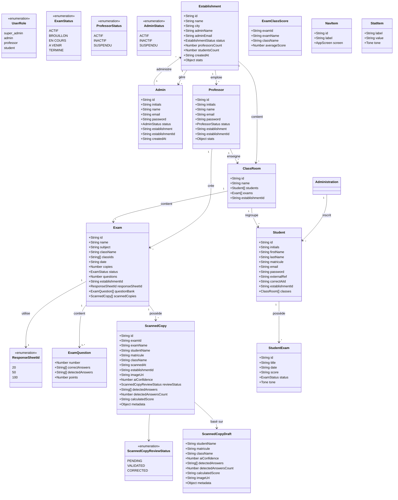
```mermaid
classDiagram
    %% Énumérations
    class UserRole {
        <<enumeration>>
        super_admin
        admin
        professor
        student
    }

    class ExamStatus {
        <<enumeration>>
        ACTIF
        BROUILLON
        EN COURS
        A VENIR
        TERMINE
    }

    class ScannedCopyReviewStatus {
        <<enumeration>>
        PENDING
        VALIDATED
        CORRECTED
    }

    class ResponseSheetId {
        <<enumeration>>
        20
        50
        100
    }

    class ProfessorStatus {
        <<enumeration>>
        ACTIF
        INACTIF
        SUSPENDU
    }

    class AdminStatus {
        <<enumeration>>
        ACTIF
        INACTIF
        SUSPENDU
    }

    %% Entités principales
    class Establishment {
        +String id
        +String name
        +String city
        +String adminName
        +String adminEmail
        +EstablishmentStatus status
        +Number professorsCount
        +Number studentsCount
        +String createdAt
        +Object stats
    }

    class Admin {
        +String id
        +String initials
        +String name
        +String email
        +String password
        +AdminStatus status
        +String establishment
        +String establishmentId
        +String createdAt
    }

    class Professor {
        +String id
        +String initials
        +String name
        +String email
        +String password
        +ProfessorStatus status
        +String establishment
        +String establishmentId
        +Object stats
    }

    class Student {
        +String id
        +String initials
        +String firstName
        +String lastName
        +String matricule
        +String email
        +String password
        +String externalRef
        +String correctAiId
        +String establishmentId
        +ClassRoom[] classes
    }

    class ClassRoom {
        +String id
        +String name
        +Student[] students
        +Exam[] exams
        +String establishmentId
    }

    class Exam {
        +String id
        +String name
        +String subject
        +String className
        +String[] classIds
        +String date
        +Number copies
        +ExamStatus status
        +Number questions
        +String establishmentId
        +ResponseSheetId responseSheetId
        +ExamQuestion[] questionBank
        +ScannedCopy[] scannedCopies
    }

    class ExamQuestion {
        +Number number
        +String[] correctAnswers
        +String[] detectedAnswers
        +Number points
    }

    class ScannedCopy {
        +String id
        +String examId
        +String examName
        +String studentName
        +String matricule
        +String className
        +String scannedAt
        +String establishmentId
        +String imageUri
        +Number aiConfidence
        +ScannedCopyReviewStatus reviewStatus
        +String[] detectedAnswers
        +Number detectedAnswersCount
        +String calculatedScore
        +Object metadata
    }

    class ScannedCopyDraft {
        +String studentName
        +String matricule
        +String className
        +Number aiConfidence
        +String[] detectedAnswers
        +Number detectedAnswersCount
        +String calculatedScore
        +String imageUri
        +Object metadata
    }

    class StudentExam {
        +String id
        +String title
        +String date
        +String score
        +ExamStatus status
        +Tone tone
    }

    class ExamClassScore {
        +String examId
        +String examName
        +String className
        +Number averageScore
    }

    class NavItem {
        +String id
        +String label
        +AppScreen screen
    }

    class StatItem {
        +String label
        +String value
        +Tone tone
    }

    %% Relations
    Establishment "1" --> "*" Admin : gère
    Establishment "1" --> "*" Professor : emploie
    Establishment "1" --> "*" ClassRoom : contient
    Administration "1" --> "*" Student : inscrit

    Admin "1" --> "*" Establishment : administre

    Professor "1" --> "*" ClassRoom : enseigne
    Professor "1" --> "*" Exam : crée

    ClassRoom "1" --> "*" Student : regroupe
    ClassRoom "1" --> "*" Exam : contient

    Exam "1" --> "1..*" ExamQuestion : contient
    Exam "1" --> "*" ScannedCopy : possède
    Exam "1" --> "1" ResponseSheetId : utilise

    ScannedCopy --> ScannedCopyReviewStatus
    ScannedCopy --> ScannedCopyDraft : basé sur

    Student "1" --> "*" StudentExam : possède
```

**Explication académique :**

Le diagramme de classes reflète la structure de données de CorrectAI. L'entité **Establishment** est l'entité racine qui contient les administrateurs, les professeurs et les classes. Chaque **Admin** est lié à un établissement spécifique. Chaque **Professor** appartient à un établissement et peut créer des examens et enseigner dans plusieurs classes. La classe **ClassRoom** regroupe des étudiants et peut contenir plusieurs examens. La classe **Exam** est l'entité centrale : elle contient un ensemble de questions (`ExamQuestion`), des copies scannées (`ScannedCopy`), et référence un type de feuille de réponse (`ResponseSheetId`). Les **ScannedCopy** représentent les copies numérisées avec leurs réponses détectées, leur statut de révision, et leur score calculé. L'utilisation d'énumérations TypeScript (`ExamStatus`, `ScannedCopyReviewStatus`, `ProfessorStatus`) garantit l'intégrité des données au niveau du typage.

---

## 5. Diagrammes de Séquence

### 5.1 Authentification

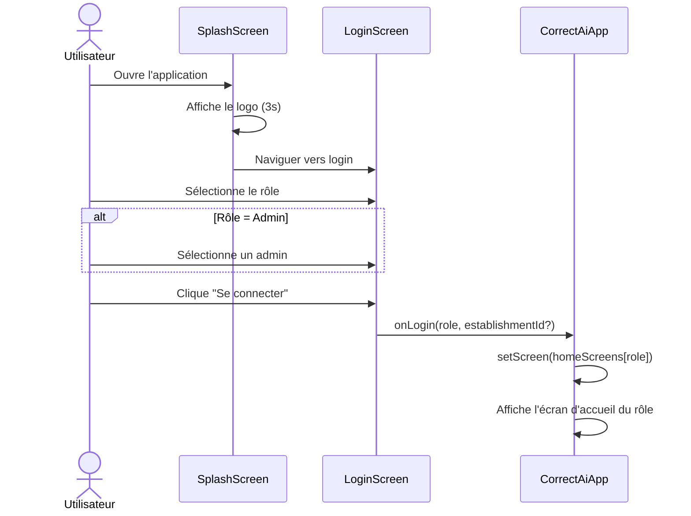
```mermaid
sequenceDiagram
    actor User as Utilisateur
    participant Splash as SplashScreen
    participant Login as LoginScreen
    participant App as CorrectAiApp

    User->>Splash: Ouvre l'application
    Splash->>Splash: Affiche le logo (3s)
    Splash->>Login: Naviguer vers login
    User->>Login: Sélectionne le rôle
    alt Rôle = Admin
        User->>Login: Sélectionne un admin
    end
    User->>Login: Clique "Se connecter"
    Login->>App: onLogin(role, establishmentId?)
    App->>App: setScreen(homeScreens[role])
    App->>App: Affiche l'écran d'accueil du rôle
```

### 5.2 Création d'un Étudiant

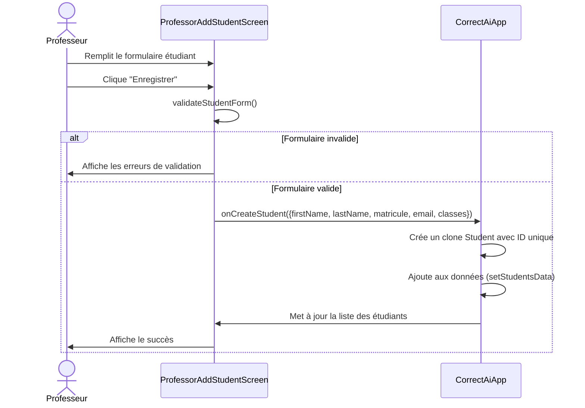
```mermaid
sequenceDiagram
    actor P as Professeur
    participant Form as ProfessorAddStudentScreen
    participant App as CorrectAiApp

    P->>Form: Remplit le formulaire étudiant
    P->>Form: Clique "Enregistrer"
    Form->>Form: validateStudentForm()
    alt Formulaire invalide
        Form->>P: Affiche les erreurs de validation
    else Formulaire valide
        Form->>App: onCreateStudent({firstName, lastName, matricule, email, classes})
        App->>App: Crée un clone Student avec ID unique
        App->>App: Ajoute aux données (setStudentsData)
        App->>Form: Met à jour la liste des étudiants
        Form->>P: Affiche le succès
    end
```

### 5.3 Création d'un Examen

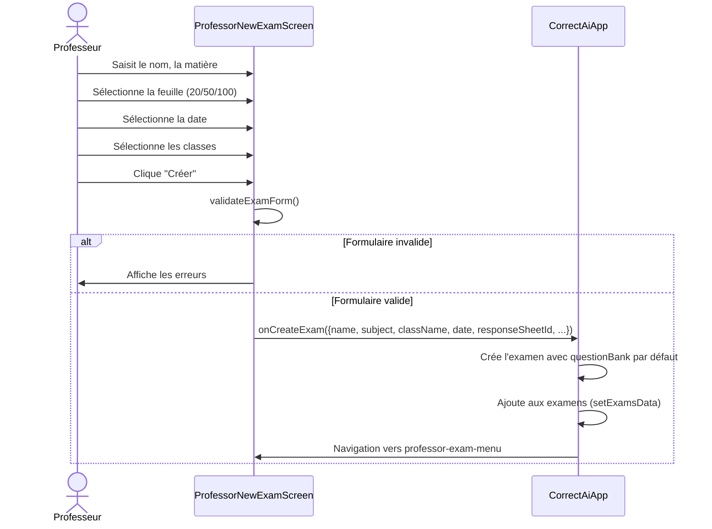
```mermaid
sequenceDiagram
    actor P as Professeur
    participant Form as ProfessorNewExamScreen
    participant App as CorrectAiApp

    P->>Form: Saisit le nom, la matière
    P->>Form: Sélectionne la feuille (20/50/100)
    P->>Form: Sélectionne la date
    P->>Form: Sélectionne les classes
    P->>Form: Clique "Créer"
    Form->>Form: validateExamForm()
    alt Formulaire invalide
        Form->>P: Affiche les erreurs
    else Formulaire valide
        Form->>App: onCreateExam({name, subject, className, date, responseSheetId, ...})
        App->>App: Crée l'examen avec questionBank par défaut
        App->>App: Ajoute aux examens (setExamsData)
        App->>Form: Navigation vers professor-exam-menu
    end
```

### 5.4 Numérisation d'une Copie

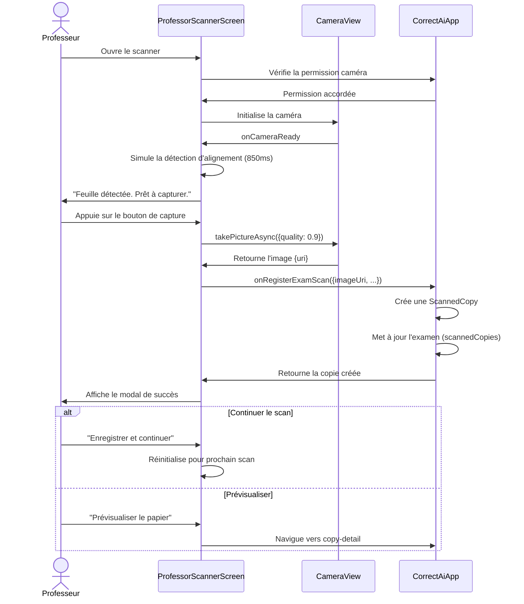
```mermaid
sequenceDiagram
    actor P as Professeur
    participant Scanner as ProfessorScannerScreen
    participant Camera as CameraView
    participant App as CorrectAiApp

    P->>Scanner: Ouvre le scanner
    Scanner->>App: Vérifie la permission caméra
    App->>Scanner: Permission accordée
    Scanner->>Camera: Initialise la caméra
    Camera->>Scanner: onCameraReady
    Scanner->>Scanner: Simule la détection d'alignement (850ms)
    Scanner->>P: "Feuille détectée. Prêt à capturer."
    P->>Scanner: Appuie sur le bouton de capture
    Scanner->>Camera: takePictureAsync({quality: 0.9})
    Camera->>Scanner: Retourne l'image {uri}
    Scanner->>App: onRegisterExamScan({imageUri, ...})
    App->>App: Crée une ScannedCopy
    App->>App: Met à jour l'examen (scannedCopies)
    App->>Scanner: Retourne la copie créée
    Scanner->>P: Affiche le modal de succès
    alt Continuer le scan
        P->>Scanner: "Enregistrer et continuer"
        Scanner->>Scanner: Réinitialise pour prochain scan
    else Prévisualiser
        P->>Scanner: "Prévisualiser le papier"
        Scanner->>App: Navigue vers copy-detail
    end
```

### 5.5 Export PDF des Copies

```mermaid
sequenceDiagram
    actor P as Professeur
    participant UI as ProfessorReviewCopiesScreen
    participant FS as expo-file-system
    participant Print as expo-print
    participant Share as expo-sharing

    P->>UI: Appuie sur l'icône Download
    UI->>UI: Vérifie copies.length
    alt Aucune copie
        UI->>P: Alert "Aucune copie scannée"
    else Copies existantes
        loop Pour chaque copie
            UI->>FS: new File(imageUri).base64()
            FS->>UI: Retourne data:image/png;base64,...
        end
        UI->>UI: buildCopiesPdfHtml()
        UI->>Print: printToFileAsync({html})
        Print->>UI: Retourne {uri: file://...}
        UI->>FS: new File(uri).contentUri
        FS->>UI: content:// URI
        UI->>Share: shareAsync(contentUri, {mimeType: 'application/pdf'})
        Share->>P: Ouvre le panneau de partage
    end
```

### 5.6 Révision et Correction d'une Copie

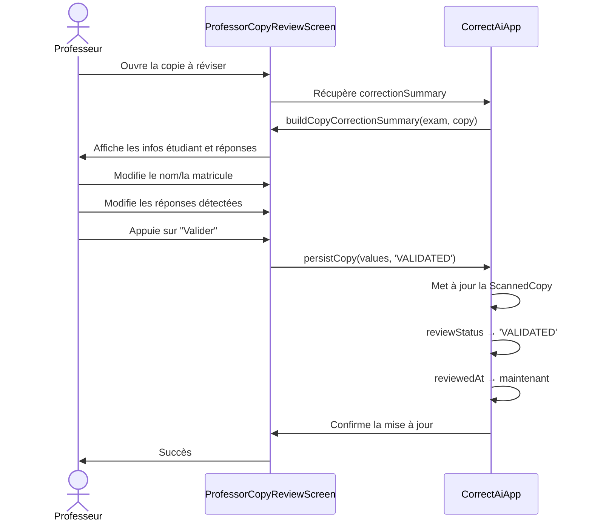
```mermaid
sequenceDiagram
    actor P as Professeur
    participant Review as ProfessorCopyReviewScreen
    participant App as CorrectAiApp

    P->>Review: Ouvre la copie à réviser
    Review->>App: Récupère correctionSummary
    App->>Review: buildCopyCorrectionSummary(exam, copy)
    Review->>P: Affiche les infos étudiant et réponses
    P->>Review: Modifie le nom/la matricule
    P->>Review: Modifie les réponses détectées
    P->>Review: Appuie sur "Valider"
    Review->>App: persistCopy(values, 'VALIDATED')
    App->>App: Met à jour la ScannedCopy
    App->>App: reviewStatus → 'VALIDATED'
    App->>App: reviewedAt → maintenant
    App->>Review: Confirme la mise à jour
    Review->>P: Succès
```

**Explication académique :**

Les diagrammes de séquence illustrent les interactions temporelles entre les acteurs et les composants du système pour les cinq workflows principaux. Le flux d'authentification montre le passage du splash screen au login puis au tableau de bord selon le rôle sélectionné. La création d'étudiant et d'examen suivent un pattern similaire : saisie, validation côté client, création via callback, et mise à jour de l'état global. Le scan de copie utilise l'appareil photo avec une détection d'alignement simulée, puis enregistre la copie dans l'état de l'application. Enfin, l'export PDF illustre le pipeline complet : conversion des images en base64, génération HTML, création du fichier PDF, obtention d'un URI de contenu, et partage via le système.

---

## 6. Diagrammes d'Activité

### 6.1 Authentification

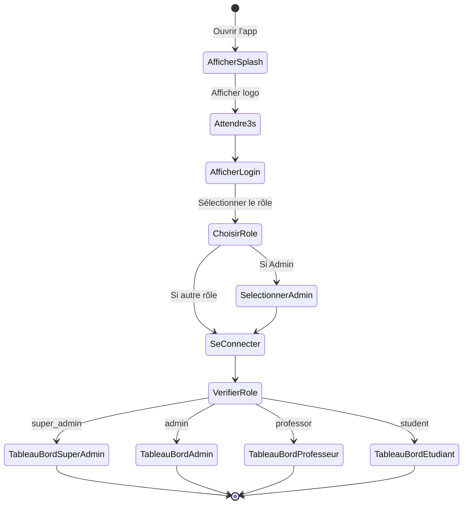
```mermaid
stateDiagram-v2
    [*] --> AfficherSplash: Ouvrir l'app
    AfficherSplash --> Attendre3s: Afficher logo
    Attendre3s --> AfficherLogin
    AfficherLogin --> ChoisirRole: Sélectionner le rôle
    ChoisirRole --> SelectionnerAdmin: Si Admin
    ChoisirRole --> SeConnecter: Si autre rôle
    SelectionnerAdmin --> SeConnecter
    SeConnecter --> VerifierRole
    VerifierRole --> TableauBordSuperAdmin: super_admin
    VerifierRole --> TableauBordAdmin: admin
    VerifierRole --> TableauBordProfesseur: professor
    VerifierRole --> TableauBordEtudiant: student
    TableauBordSuperAdmin --> [*]
    TableauBordAdmin --> [*]
    TableauBordProfesseur --> [*]
    TableauBordEtudiant --> [*]
```

### 6.2 Création d'un Examen

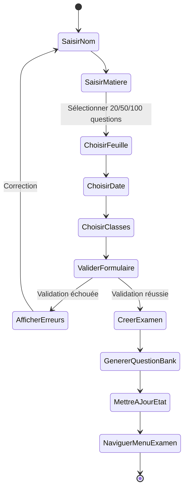
```mermaid
stateDiagram-v2
    [*] --> SaisirNom
    SaisirNom --> SaisirMatiere
    SaisirMatiere --> ChoisirFeuille: Sélectionner 20/50/100 questions
    ChoisirFeuille --> ChoisirDate
    ChoisirDate --> ChoisirClasses
    ChoisirClasses --> ValiderFormulaire
    ValiderFormulaire --> AfficherErreurs: Validation échouée
    AfficherErreurs --> SaisirNom: Correction
    ValiderFormulaire --> CreerExamen: Validation réussie
    CreerExamen --> GenererQuestionBank
    GenererQuestionBank --> MettreAJourEtat
    MettreAJourEtat --> NaviguerMenuExamen
    NaviguerMenuExamen --> [*]
```

### 6.3 Numérisation d'une Copie

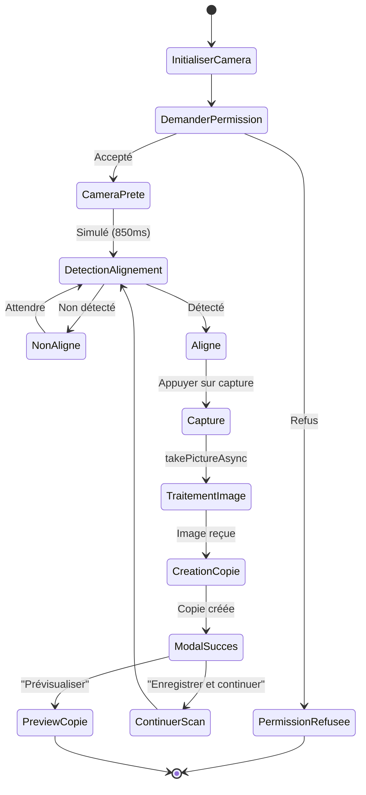
```mermaid
stateDiagram-v2
    [*] --> InitialiserCamera
    InitialiserCamera --> DemanderPermission
    DemanderPermission --> PermissionRefusee: Refus
    PermissionRefusee --> [*]
    DemanderPermission --> CameraPrete: Accepté
    CameraPrete --> DetectionAlignement: Simulé (850ms)
    DetectionAlignement --> NonAligne: Non détecté
    NonAligne --> DetectionAlignement: Attendre
    DetectionAlignement --> Aligne: Détecté
    Aligne --> Capture: Appuyer sur capture
    Capture --> TraitementImage: takePictureAsync
    TraitementImage --> CreationCopie: Image reçue
    CreationCopie --> ModalSucces: Copie créée
    ModalSucces --> ContinuerScan: "Enregistrer et continuer"
    ModalSucces --> PreviewCopie: "Prévisualiser"
    ContinuerScan --> DetectionAlignement
    PreviewCopie --> [*]
```

### 6.4 Révision d'une Copie

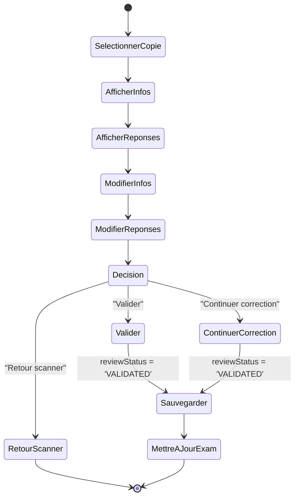
```mermaid
stateDiagram-v2
    [*] --> SelectionnerCopie
    SelectionnerCopie --> AfficherInfos
    AfficherInfos --> AfficherReponses
    AfficherReponses --> ModifierInfos
    ModifierInfos --> ModifierReponses
    ModifierReponses --> Decision
    Decision --> Valider: "Valider"
    Decision --> ContinuerCorrection: "Continuer correction"
    Decision --> RetourScanner: "Retour scanner"
    Valider --> Sauvegarder: reviewStatus = 'VALIDATED'
    ContinuerCorrection --> Sauvegarder: reviewStatus = 'VALIDATED'
    RetourScanner --> [*]
    Sauvegarder --> MettreAJourExam
    MettreAJourExam --> [*]
```

### 6.5 Correction des Réponses

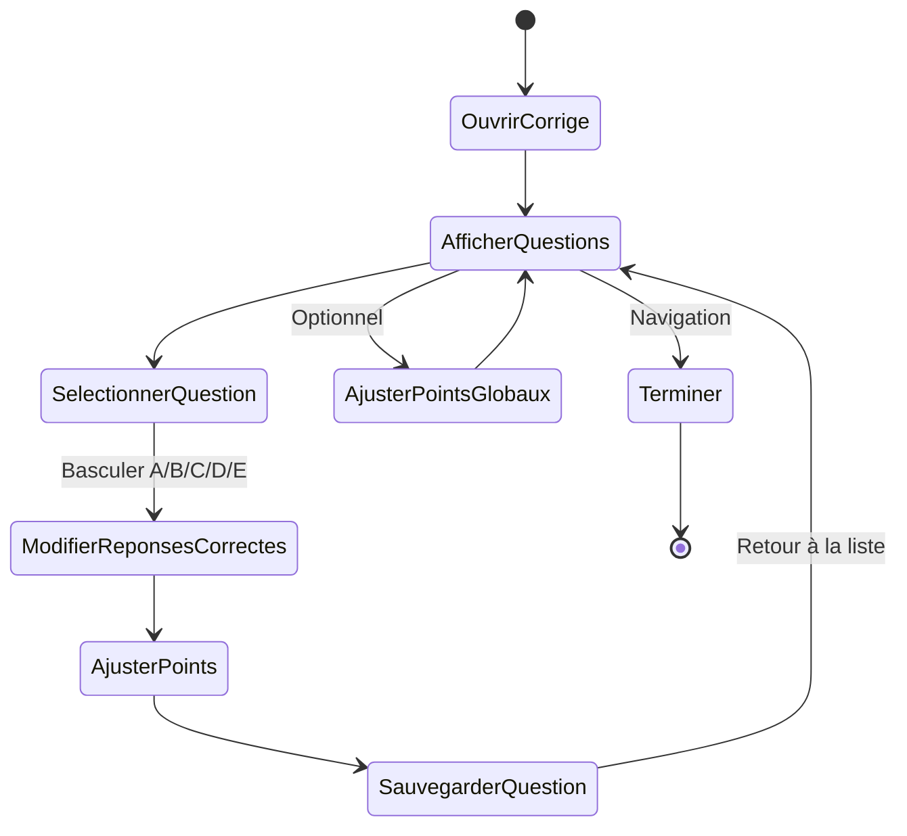
```mermaid
stateDiagram-v2
    [*] --> OuvrirCorrige
    OuvrirCorrige --> AfficherQuestions
    AfficherQuestions --> SelectionnerQuestion
    SelectionnerQuestion --> ModifierReponsesCorrectes: Basculer A/B/C/D/E
    ModifierReponsesCorrectes --> AjusterPoints
    AjusterPoints --> SauvegarderQuestion
    SauvegarderQuestion --> AfficherQuestions: Retour à la liste
    AfficherQuestions --> AjusterPointsGlobaux: Optionnel
    AjusterPointsGlobaux --> AfficherQuestions
    AfficherQuestions --> Terminer: Navigation
    Terminer --> [*]
```

**Explication académique :**

Les diagrammes d'activité décrivent les flux de travail pas à pas pour les cinq processus principaux de CorrectAI. Le diagramme d'authentification montre le cheminement depuis l'ouverture de l'application jusqu'au tableau de bord spécifique au rôle. La création d'examen suit un parcours séquentiel de saisie avec une boucle de validation en cas d'erreur. La numérisation de copie est le processus le plus complexe, impliquant la caméra, la détection d'alignement (simulée), la capture, et les actions post-scan. La révision de copie permet la modification des informations et des réponses avant validation. Enfin, la correction des réponses (définition du corrigé) offre une navigation flexible entre les questions avec modification des réponses correctes et ajustement des points.

---

## 7. Diagramme de Composants

### Description

Le diagramme de composants illustre l'architecture logicielle de CorrectAI en montrant les dépendances entre les différents modules. Le composant central `CorrectAiApp` orchestre l'ensemble en dépendant de la couche de données mockées, des utilitaires, et en fournissant les callbacks aux écrans.

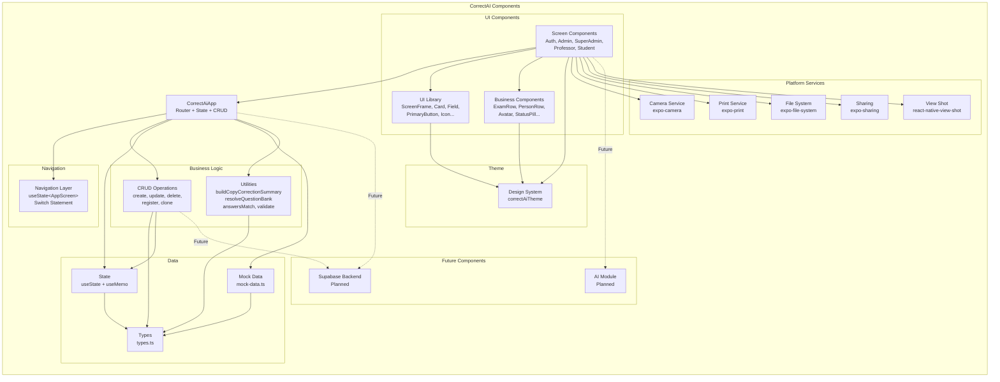
```mermaid
graph TB
    subgraph "CorrectAI Components"
        direction TB

        CORE[CorrectAiApp<br/>Router + State + CRUD]

        subgraph "UI Components"
            SC[Screen Components<br/>Auth, Admin, SuperAdmin,<br/>Professor, Student]
            UIC[UI Library<br/>ScreenFrame, Card, Field,<br/>PrimaryButton, Icon...]
            METIER[Business Components<br/>ExamRow, PersonRow,<br/>Avatar, StatusPill...]
        end

        subgraph "Navigation"
            NAV[Navigation Layer<br/>useState&lt;AppScreen&gt;<br/>Switch Statement]
        end

        subgraph "Business Logic"
            CRUD[CRUD Operations<br/>create, update, delete,<br/>register, clone]
            UTIL[Utilities<br/>buildCopyCorrectionSummary<br/>resolveQuestionBank<br/>answersMatch, validate]
        end

        subgraph "Data"
            MOCK[Mock Data<br/>mock-data.ts]
            STATE[State<br/>useState + useMemo]
            TYPES[Types<br/>types.ts]
        end

        subgraph "Theme"
            THEME[Design System<br/>correctAiTheme]
        end

        subgraph "Platform Services"
            CAM[Camera Service<br/>expo-camera]
            PRINT[Print Service<br/>expo-print]
            FS[File System<br/>expo-file-system]
            SHARE[Sharing<br/>expo-sharing]
            VIEWSHOT[View Shot<br/>react-native-view-shot]
        end

        subgraph "Future Components"
            SUPABASE[Supabase Backend<br/>Planned]
            AI[AI Module<br/>Planned]
        end
    end

    %% Dependencies
    CORE --> NAV
    CORE --> CRUD
    CORE --> STATE
    CORE --> MOCK
    CORE --> UTIL

    SC --> CORE
    SC --> UIC
    SC --> METIER
    SC --> THEME
    SC --> CAM
    SC --> PRINT
    SC --> FS
    SC --> SHARE
    SC --> VIEWSHOT

    CRUD --> TYPES
    CRUD --> STATE
    UTIL --> TYPES

    MOCK --> TYPES
    STATE --> TYPES

    UIC --> THEME
    METIER --> THEME

    CORE -.->|Future| SUPABASE
    CRUD -.->|Future| SUPABASE
    SC -.->|Future| AI
```

**Explication académique :**

Le diagramme de composants met en évidence l'architecture en couches de CorrectAI. Le composant central `CorrectAiApp` agit comme un **orchestrateur** qui dépend de la couche de navigation, de la logique CRUD, de l'état, des données mockées, et des utilitaires. Les composants d'écran dépendent de `CorrectAiApp` pour les données et callbacks, de la bibliothèque UI pour le rendu, et des services plateforme (caméra, impression, fichier). Les dépendances futures vers Supabase et le module IA sont indiquées en pointillé. Cette architecture maintient une **séparation claire** entre la présentation, la logique métier et les données, bien que le tout soit actuellement contenu dans une seule application cliente.

---

## 8. Diagramme de Paquetages

### Description

Le diagramme de paquetages représente l'organisation physique du code source dans les dossiers du projet. Il montre la hiérarchie des modules et les regroupements logiques.

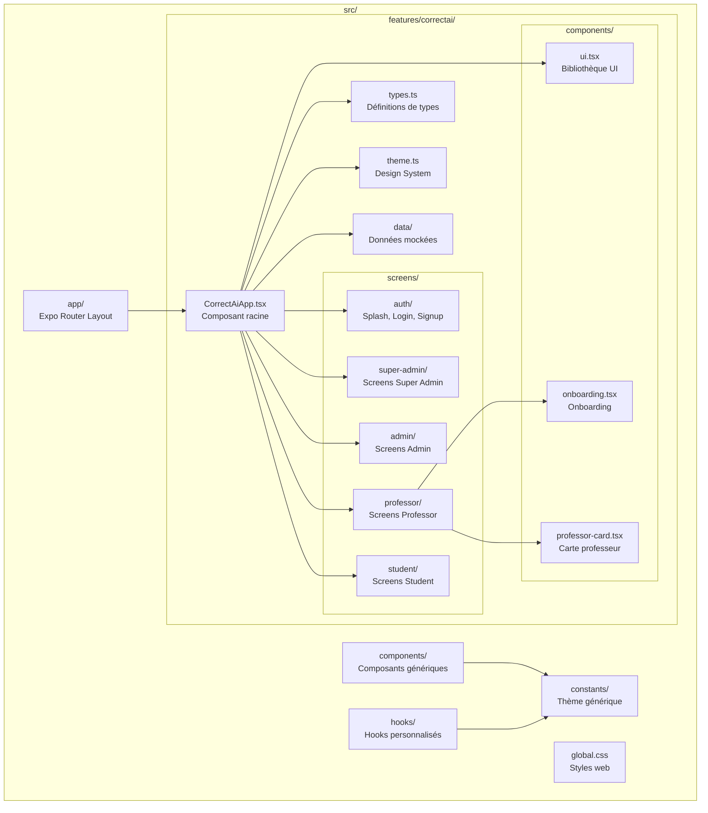
```mermaid
graph TB
    subgraph "src/"
        APP[app/<br/>Expo Router Layout]

        COMPONENTS[components/<br/>Composants génériques]
        CONSTANTS[constants/<br/>Thème générique]
        HOOKS[hooks/<br/>Hooks personnalisés]
        GLOBAL_CSS[global.css<br/>Styles web]

        subgraph "features/correctai/"
            CORRECTAI[CorrectAiApp.tsx<br/>Composant racine]
            TYPES[types.ts<br/>Définitions de types]
            THEME[theme.ts<br/>Design System]
            DATA[data/<br/>Données mockées]

            subgraph "components/"
                UI[ui.tsx<br/>Bibliothèque UI]
                ONBOARDING[onboarding.tsx<br/>Onboarding]
                PROF_CARD[professor-card.tsx<br/>Carte professeur]
            end

            subgraph "screens/"
                AUTH[auth/<br/>Splash, Login, Signup]
                SUPER_ADMIN[super-admin/<br/>Screens Super Admin]
                ADMIN[admin/<br/>Screens Admin]
                PROF[professor/<br/>Screens Professor]
                STUDENT[student/<br/>Screens Student]
            end
        end
    end

    CORRECTAI --> TYPES
    CORRECTAI --> THEME
    CORRECTAI --> DATA
    CORRECTAI --> UI
    CORRECTAI --> AUTH
    CORRECTAI --> SUPER_ADMIN
    CORRECTAI --> ADMIN
    CORRECTAI --> PROF
    CORRECTAI --> STUDENT
    PROF --> ONBOARDING
    PROF --> PROF_CARD
    APP --> CORRECTAI
    COMPONENTS --> CONSTANTS
    HOOKS --> CONSTANTS
```

**Explication académique :**

Le diagramme de paquetages montre la structure physique du projet CorrectAI. Le dossier `src/` contient le code source organisé en modules fonctionnels. Le module principal `features/correctai/` regroupe l'ensemble de la logique métier, des écrans, des types et du système de design. La séparation en sous-dossiers (`screens/auth/`, `screens/admin/`, `screens/professor/`, etc.) reflète l'architecture orientée rôles de l'application. Les dossiers `components/`, `constants/` et `hooks/` à la racine de `src/` contiennent des éléments génériques partagés entre les modules. Le composant racine `CorrectAiApp.tsx` est le point d'entrée qui orchestre l'ensemble du module.

---

## 9. Diagramme de Déploiement

### Description

Le diagramme de déploiement illustre l'architecture physique de CorrectAI. Actuellement, l'application fonctionne entièrement sur le périphérique mobile (ou le navigateur web) sans backend distant. Le déploiement futur prévoit l'intégration de Supabase pour la persistance des données et l'authentification, ainsi qu'un module IA pour le traitement des copies.

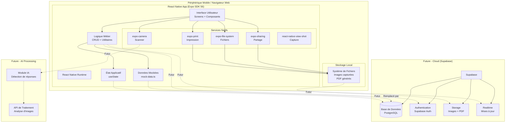
```mermaid
graph TB
    subgraph "Périphérique Mobile / Navigateur Web"
        subgraph "React Native App (Expo SDK 56)"
            RN[React Native Runtime]
            UI[Interface Utilisateur<br/>Screens + Composants]
            LOGIC[Logique Métier<br/>CRUD + Utilitaires]
            STATE[État Applicatif<br/>useState]
            MOCK[Données Mockées<br/>mock-data.ts]

            subgraph "Services Natifs"
                CAM[expo-camera<br/>Scanner]
                PRINT[expo-print<br/>Impression]
                FS[expo-file-system<br/>Fichiers]
                SHARE[expo-sharing<br/>Partage]
                VIEWSHOT[react-native-view-shot<br/>Capture]
            end
        end

        subgraph "Stockage Local"
            LOCAL_FILES[Système de Fichiers<br/>Images capturées<br/>PDF générés]
        end
    end

    subgraph "Future - Cloud (Supabase)"
        SUPABASE[Supabase]
        SUPABASE_DB[(Base de Données<br/>PostgreSQL)]
        SUPABASE_AUTH[Authentication<br/>Supabase Auth]
        SUPABASE_STORAGE[Storage<br/>Images + PDF]
        SUPABASE_REALTIME[Realtime<br/>Mises à jour]
    end

    subgraph "Future - AI Processing"
        AI_MODULE[Module IA<br/>Détection de réponses]
        AI_API[API de Traitement<br/>Analyse d'images]
    end

    %% Relations actuelles
    UI --> LOGIC
    LOGIC --> STATE
    LOGIC --> MOCK
    UI --> CAM
    UI --> PRINT
    UI --> FS
    UI --> SHARE
    PRINT --> LOCAL_FILES
    FS --> LOCAL_FILES
    SHARE --> LOCAL_FILES

    %% Relations futures
    STATE -.->|Futur| SUPABASE_DB
    LOGIC -.->|Futur| SUPABASE_AUTH
    LOGIC -.->|Futur| SUPABASE_REALTIME
    LOCAL_FILES -.->|Futur| SUPABASE_STORAGE
    CAM -.->|Futur| AI_MODULE
    AI_MODULE -.-> AI_API
    MOCK -.->|Remplacé par| SUPABASE_DB
    SUPABASE --> SUPABASE_DB
    SUPABASE --> SUPABASE_AUTH
    SUPABASE --> SUPABASE_STORAGE
    SUPABASE --> SUPABASE_REALTIME
```

**Explication académique :**

Le diagramme de déploiement présente l'architecture physique de CorrectAI. Actuellement, l'application s'exécute entièrement sur le périphérique client en tant qu'application React Native utilisant Expo SDK 56. Toutes les données résident en mémoire (mock-data.ts) ou dans le système de fichiers local (images capturées, PDF générés). Les services natifs (caméra, impression, système de fichiers, partage) sont accessibles via les modules Expo. L'architecture future (indiquée en pointillé) prévoit l'intégration de **Supabase** comme backend cloud avec une base de données PostgreSQL, un système d'authentification, et un stockage de fichiers. Un **module IA** distinct assurerait la détection automatique des réponses à partir des images scannées. Cette évolution transformera l'architecture d'une application monolithique client vers une architecture **client-serveur** avec des services cloud spécialisés.

---

## 10. Code Mermaid Complet

### 10.1 Architecture Globale


```mermaid
graph TB
    subgraph "CorrectAI App (React Native / Expo SDK 56)"
        direction TB

        subgraph "Presentation Layer"
            AS[AUTH Screens<br/>Login, Signup, ForgotPassword]
            SS[SUPER-ADMIN Screens<br/>Home, Establishments, Admins, Professors]
            ADS[ADMIN Screens<br/>Home, Professors]
            PS[PROFESSOR Screens<br/>Home, Students, Classes, Exams,<br/>Scanner, AnswerKey, Review,<br/>AnswerSheet, Account]
            STS[STUDENT Screens<br/>Home, Exams, Report, Profile]
            UI[Shared UI Components<br/>ScreenFrame, Card, Field,<br/>PrimaryButton, Avatar, etc.]
        end

        subgraph "Navigation Layer"
            NAV[CorrectAiApp<br/>useState&lt;AppScreen&gt;<br/>Switch-based router]
        end

        subgraph "Business Logic Layer"
            CRUD[CRUD Callbacks<br/>createExam, updateExam,<br/>registerExamScan, cloneExam...]
            UTILS[Utilities<br/>buildCopyCorrectionSummary,<br/>resolveQuestionBank, answersMatch<br/>validateExamForm...]
        end

        subgraph "Data Layer"
            MOCK[Mock Data<br/>mock-data.ts]
            STATE[State Management<br/>useState + useMemo]
        end

        subgraph "Theme Layer"
            THEME[correctAiTheme<br/>colors, radius, spacing]
            SYSTHEME[System Theme<br/>light/dark mode]
        end

        subgraph "Feature Modules"
            SCANNER[Scanner Module<br/>expo-camera]
            PRINT[Print Module<br/>expo-print + view-shot]
            PDF[PDF Export<br/>expo-file-system + expo-sharing]
        end
    end

    subgraph "Future Architecture"
        SUPABASE[(Supabase<br/>PostgreSQL + Storage)]
        AI[AI Module<br/>Answer Detection]
    end

    NAV --> AS
    NAV --> SS
    NAV --> ADS
    NAV --> PS
    NAV --> STS
    PS --> UI
    SS --> UI
    ADS --> UI
    AS --> UI
    STS --> UI

    CRUD --> MOCK
    CRUD --> STATE
    UTILS --> STATE
    PS --> CRUD
    PS --> UTILS

    PS --> SCANNER
    PS --> PRINT
    PS --> PDF

    THEME --> UI
    SYSTHEME --> UI

    MOCK -.->|Future| SUPABASE
    SCANNER -.->|Future| AI
    PDF -.->|Future| SUPABASE
```

### 10.2 Diagramme de Cas d'Utilisation


```mermaid
graph TB
    subgraph "CorrectAI Application"
        direction TB

        SA("Super Admin")
        A("Admin")
        P("Professeur")
        S("Étudiant")

        UC1("S'authentifier")
        UC2("Consulter le tableau de bord")
        UC_SA1("Gérer les établissements")
        UC_SA2("Gérer les admins")
        UC_SA3("Gérer les professeurs")
        UC_SA4("Consulter les statistiques globales")
        UC_A1("Gérer les professeurs")
        UC_A2("Consulter les statistiques")
        UC_P1("Gérer les étudiants")
        UC_P2("Gérer les classes")
        UC_P3("Gérer les examens")
        UC_P4("Créer un examen")
        UC_P5("Scanner une feuille de réponses")
        UC_P6("Définir le corrigé")
        UC_P7("Réviser les copies")
        UC_P8("Corriger les réponses")
        UC_P9("Consulter une copie détaillée")
        UC_P10("Imprimer la feuille de réponses")
        UC_P11("Exporter le PDF des copies")
        UC_P12("Gérer le compte")
        UC_S1("Consulter les résultats")
        UC_S2("Consulter le relevé de notes")
        UC_S3("Consulter le profil")

        SA --- UC1 & UC2 & UC_SA1 & UC_SA2 & UC_SA3 & UC_SA4
        A --- UC1 & UC2 & UC_A1 & UC_A2
        P --- UC1 & UC2 & UC_P1 & UC_P2 & UC_P3 & UC_P4 & UC_P5 & UC_P6 & UC_P7 & UC_P8 & UC_P9 & UC_P10 & UC_P11 & UC_P12
        S --- UC1 & UC_S1 & UC_S2 & UC_S3

        UC_P4 -.->|include| UC_P6
        UC_P5 -.->|include| UC_P7
        UC_P5 -.->|include| UC_P6
        UC_P6 -.->|extend| UC_P8
        UC_P7 -.->|include| UC_P9
        UC_P11 -.->|extend| UC_P10
    end
```

### 10.3 Diagramme de Classes

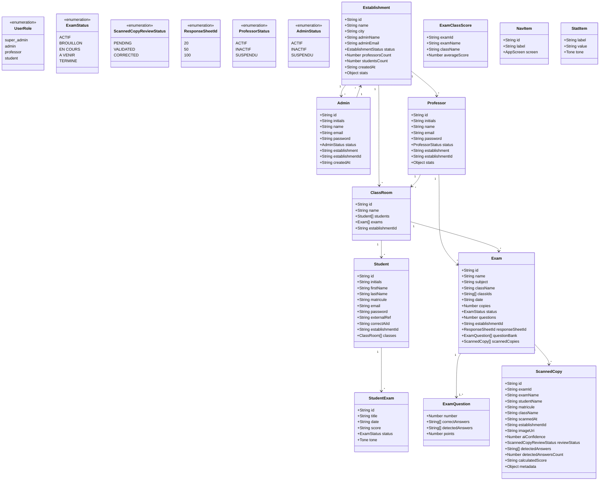
```mermaid
classDiagram
    class UserRole {
        <<enumeration>>
        super_admin
        admin
        professor
        student
    }
    class ExamStatus {
        <<enumeration>>
        ACTIF
        BROUILLON
        EN COURS
        A VENIR
        TERMINE
    }
    class ScannedCopyReviewStatus {
        <<enumeration>>
        PENDING
        VALIDATED
        CORRECTED
    }
    class ResponseSheetId {
        <<enumeration>>
        20
        50
        100
    }
    class ProfessorStatus {
        <<enumeration>>
        ACTIF
        INACTIF
        SUSPENDU
    }
    class AdminStatus {
        <<enumeration>>
        ACTIF
        INACTIF
        SUSPENDU
    }
    class Establishment {
        +String id
        +String name
        +String city
        +String adminName
        +String adminEmail
        +EstablishmentStatus status
        +Number professorsCount
        +Number studentsCount
        +String createdAt
        +Object stats
    }
    class Admin {
        +String id
        +String initials
        +String name
        +String email
        +String password
        +AdminStatus status
        +String establishment
        +String establishmentId
        +String createdAt
    }
    class Professor {
        +String id
        +String initials
        +String name
        +String email
        +String password
        +ProfessorStatus status
        +String establishment
        +String establishmentId
        +Object stats
    }
    class Student {
        +String id
        +String initials
        +String firstName
        +String lastName
        +String matricule
        +String email
        +String password
        +String externalRef
        +String correctAiId
        +String establishmentId
        +ClassRoom[] classes
    }
    class ClassRoom {
        +String id
        +String name
        +Student[] students
        +Exam[] exams
        +String establishmentId
    }
    class Exam {
        +String id
        +String name
        +String subject
        +String className
        +String[] classIds
        +String date
        +Number copies
        +ExamStatus status
        +Number questions
        +String establishmentId
        +ResponseSheetId responseSheetId
        +ExamQuestion[] questionBank
        +ScannedCopy[] scannedCopies
    }
    class ExamQuestion {
        +Number number
        +String[] correctAnswers
        +String[] detectedAnswers
        +Number points
    }
    class ScannedCopy {
        +String id
        +String examId
        +String examName
        +String studentName
        +String matricule
        +String className
        +String scannedAt
        +String establishmentId
        +String imageUri
        +Number aiConfidence
        +ScannedCopyReviewStatus reviewStatus
        +String[] detectedAnswers
        +Number detectedAnswersCount
        +String calculatedScore
        +Object metadata
    }
    class StudentExam {
        +String id
        +String title
        +String date
        +String score
        +ExamStatus status
        +Tone tone
    }
    class ExamClassScore {
        +String examId
        +String examName
        +String className
        +Number averageScore
    }
    class NavItem {
        +String id
        +String label
        +AppScreen screen
    }
    class StatItem {
        +String label
        +String value
        +Tone tone
    }

    Establishment "1" --> "*" Admin
    Establishment "1" --> "*" Professor
    Establishment "1" --> "*" ClassRoom
    Admin "1" --> "*" Establishment
    Professor "1" --> "*" ClassRoom
    Professor "1" --> "*" Exam
    ClassRoom "1" --> "*" Student
    ClassRoom "1" --> "*" Exam
    Exam "1" --> "1..*" ExamQuestion
    Exam "1" --> "*" ScannedCopy
    Student "1" --> "*" StudentExam
```

### 10.4 Diagrammes de Séquence

#### Authentification

```mermaid
sequenceDiagram
    actor User as Utilisateur
    participant Splash as SplashScreen
    participant Login as LoginScreen
    participant App as CorrectAiApp

    User->>Splash: Ouvre l'application
    Splash->>Splash: Affiche le logo (3s)
    Splash->>Login: Naviguer vers login
    User->>Login: Sélectionne le rôle
    alt Rôle = Admin
        User->>Login: Sélectionne un admin
    end
    User->>Login: Clique "Se connecter"
    Login->>App: onLogin(role, establishmentId?)
    App->>App: setScreen(homeScreens[role])
    App->>App: Affiche l'écran d'accueil du rôle
```

#### Création d'un Étudiant

```mermaid
sequenceDiagram
    actor P as Professeur
    participant Form as ProfessorAddStudentScreen
    participant App as CorrectAiApp

    P->>Form: Remplit le formulaire étudiant
    P->>Form: Clique "Enregistrer"
    Form->>Form: validateStudentForm()
    alt Formulaire invalide
        Form->>P: Affiche les erreurs de validation
    else Formulaire valide
        Form->>App: onCreateStudent({firstName, lastName, matricule, email, classes})
        App->>App: Crée un clone Student avec ID unique
        App->>App: Ajoute aux données (setStudentsData)
        App->>Form: Met à jour la liste des étudiants
        Form->>P: Affiche le succès
    end
```

#### Création d'un Examen

```mermaid
sequenceDiagram
    actor P as Professeur
    participant Form as ProfessorNewExamScreen
    participant App as CorrectAiApp

    P->>Form: Saisit le nom, la matière
    P->>Form: Sélectionne la feuille (20/50/100)
    P->>Form: Sélectionne la date
    P->>Form: Sélectionne les classes
    P->>Form: Clique "Créer"
    Form->>Form: validateExamForm()
    alt Formulaire invalide
        Form->>P: Affiche les erreurs
    else Formulaire valide
        Form->>App: onCreateExam({name, subject, className, date, responseSheetId, ...})
        App->>App: Crée l'examen avec questionBank par défaut
        App->>App: Ajoute aux examens (setExamsData)
        App->>Form: Navigation vers professor-exam-menu
    end
```

#### Numérisation d'une Copie

```mermaid
sequenceDiagram
    actor P as Professeur
    participant Scanner as ProfessorScannerScreen
    participant Camera as CameraView
    participant App as CorrectAiApp

    P->>Scanner: Ouvre le scanner
    Scanner->>App: Vérifie la permission caméra
    App->>Scanner: Permission accordée
    Scanner->>Camera: Initialise la caméra
    Camera->>Scanner: onCameraReady
    Scanner->>Scanner: Simule la détection d'alignement (850ms)
    Scanner->>P: "Feuille détectée. Prêt à capturer."
    P->>Scanner: Appuie sur le bouton de capture
    Scanner->>Camera: takePictureAsync({quality: 0.9})
    Camera->>Scanner: Retourne l'image {uri}
    Scanner->>App: onRegisterExamScan({imageUri, ...})
    App->>App: Crée une ScannedCopy
    App->>App: Met à jour l'examen (scannedCopies)
    App->>Scanner: Retourne la copie créée
    Scanner->>P: Affiche le modal de succès
    alt Continuer le scan
        P->>Scanner: "Enregistrer et continuer"
        Scanner->>Scanner: Réinitialise pour prochain scan
    else Prévisualiser
        P->>Scanner: "Prévisualiser le papier"
        Scanner->>App: Navigue vers copy-detail
    end
```

#### Export PDF

```mermaid
sequenceDiagram
    actor P as Professeur
    participant UI as ProfessorReviewCopiesScreen
    participant FS as expo-file-system
    participant Print as expo-print
    participant Share as expo-sharing

    P->>UI: Appuie sur l'icône Download
    UI->>UI: Vérifie copies.length
    alt Aucune copie
        UI->>P: Alert "Aucune copie scannée"
    else Copies existantes
        loop Pour chaque copie
            UI->>FS: new File(imageUri).base64()
            FS->>UI: Retourne data:image/png;base64,...
        end
        UI->>UI: buildCopiesPdfHtml()
        UI->>Print: printToFileAsync({html})
        Print->>UI: Retourne {uri: file://...}
        UI->>FS: new File(uri).contentUri
        FS->>UI: content:// URI
        UI->>Share: shareAsync(contentUri, {mimeType: 'application/pdf'})
        Share->>P: Ouvre le panneau de partage
    end
```

### 10.5 Diagrammes d'Activité

#### Authentification

```mermaid
stateDiagram-v2
    [*] --> AfficherSplash: Ouvrir l'app
    AfficherSplash --> Attendre3s: Afficher logo
    Attendre3s --> AfficherLogin
    AfficherLogin --> ChoisirRole: Sélectionner le rôle
    ChoisirRole --> SelectionnerAdmin: Si Admin
    ChoisirRole --> SeConnecter: Si autre rôle
    SelectionnerAdmin --> SeConnecter
    SeConnecter --> VerifierRole
    VerifierRole --> TableauBordSuperAdmin: super_admin
    VerifierRole --> TableauBordAdmin: admin
    VerifierRole --> TableauBordProfesseur: professor
    VerifierRole --> TableauBordEtudiant: student
    TableauBordSuperAdmin --> [*]
    TableauBordAdmin --> [*]
    TableauBordProfesseur --> [*]
    TableauBordEtudiant --> [*]
```

#### Création d'un Examen

```mermaid
stateDiagram-v2
    [*] --> SaisirNom
    SaisirNom --> SaisirMatiere
    SaisirMatiere --> ChoisirFeuille
    ChoisirFeuille --> ChoisirDate
    ChoisirDate --> ChoisirClasses
    ChoisirClasses --> ValiderFormulaire
    ValiderFormulaire --> AfficherErreurs: Validation échouée
    AfficherErreurs --> SaisirNom: Correction
    ValiderFormulaire --> CreerExamen: Validation réussie
    CreerExamen --> GenererQuestionBank
    GenererQuestionBank --> MettreAJourEtat
    MettreAJourEtat --> NaviguerMenuExamen
    NaviguerMenuExamen --> [*]
```

#### Numérisation d'une Copie

```mermaid
stateDiagram-v2
    [*] --> InitialiserCamera
    InitialiserCamera --> DemanderPermission
    DemanderPermission --> PermissionRefusee: Refus
    PermissionRefusee --> [*]
    DemanderPermission --> CameraPrete: Accepté
    CameraPrete --> DetectionAlignement
    DetectionAlignement --> NonAligne: Non détecté
    NonAligne --> DetectionAlignement: Attendre
    DetectionAlignement --> Aligne: Détecté
    Aligne --> Capture
    Capture --> TraitementImage
    TraitementImage --> CreationCopie
    CreationCopie --> ModalSucces
    ModalSucces --> ContinuerScan
    ModalSucces --> PreviewCopie
    ContinuerScan --> DetectionAlignement
    PreviewCopie --> [*]
```

#### Révision d'une Copie

```mermaid
stateDiagram-v2
    [*] --> SelectionnerCopie
    SelectionnerCopie --> AfficherInfos
    AfficherInfos --> AfficherReponses
    AfficherReponses --> ModifierInfos
    ModifierInfos --> ModifierReponses
    ModifierReponses --> Decision
    Decision --> Valider
    Decision --> ContinuerCorrection
    Decision --> RetourScanner
    Valider --> Sauvegarder
    ContinuerCorrection --> Sauvegarder
    RetourScanner --> [*]
    Sauvegarder --> MettreAJourExam
    MettreAJourExam --> [*]
```

#### Correction des Réponses

```mermaid
stateDiagram-v2
    [*] --> OuvrirCorrige
    OuvrirCorrige --> AfficherQuestions
    AfficherQuestions --> SelectionnerQuestion
    SelectionnerQuestion --> ModifierReponsesCorrectes
    ModifierReponsesCorrectes --> AjusterPoints
    AjusterPoints --> SauvegarderQuestion
    SauvegarderQuestion --> AfficherQuestions
    AfficherQuestions --> AjusterPointsGlobaux
    AjusterPointsGlobaux --> AfficherQuestions
    AfficherQuestions --> Terminer
    Terminer --> [*]
```

### 10.6 Diagramme de Composants

```mermaid
graph TB
    subgraph "CorrectAI Components"
        CORE[CorrectAiApp<br/>Router + State + CRUD]
        subgraph "UI Components"
            SC[Screen Components<br/>Auth, Admin, SuperAdmin,<br/>Professor, Student]
            UIC[UI Library<br/>ScreenFrame, Card, Field,<br/>PrimaryButton, Icon...]
            METIER[Business Components<br/>ExamRow, PersonRow,<br/>Avatar, StatusPill...]
        end
        subgraph "Navigation"
            NAV[Navigation Layer<br/>useState&lt;AppScreen&gt;<br/>Switch Statement]
        end
        subgraph "Business Logic"
            CRUD[CRUD Operations<br/>create, update, delete,<br/>register, clone]
            UTIL[Utilities<br/>buildCopyCorrectionSummary<br/>resolveQuestionBank<br/>answersMatch, validate]
        end
        subgraph "Data"
            MOCK[Mock Data<br/>mock-data.ts]
            STATE[State<br/>useState + useMemo]
            TYPES[Types<br/>types.ts]
        end
        subgraph "Theme"
            THEME[Design System<br/>correctAiTheme]
        end
        subgraph "Platform Services"
            CAM[Camera Service<br/>expo-camera]
            PRINT[Print Service<br/>expo-print]
            FS[File System<br/>expo-file-system]
            SHARE[Sharing<br/>expo-sharing]
            VIEWSHOT[View Shot<br/>react-native-view-shot]
        end
        subgraph "Future Components"
            SUPABASE[Supabase Backend<br/>Planned]
            AI[AI Module<br/>Planned]
        end
    end
    CORE --> NAV
    CORE --> CRUD
    CORE --> STATE
    CORE --> MOCK
    CORE --> UTIL
    SC --> CORE
    SC --> UIC
    SC --> METIER
    SC --> THEME
    SC --> CAM
    SC --> PRINT
    SC --> FS
    SC --> SHARE
    SC --> VIEWSHOT
    CRUD --> TYPES
    CRUD --> STATE
    UTIL --> TYPES
    MOCK --> TYPES
    STATE --> TYPES
    UIC --> THEME
    METIER --> THEME
    CORE -.->|Future| SUPABASE
    CRUD -.->|Future| SUPABASE
    SC -.->|Future| AI
```

### 10.7 Diagramme de Paquetages

```mermaid
graph TB
    subgraph "src/"
        APP[app/<br/>Expo Router Layout]
        COMPONENTS[components/<br/>Composants génériques]
        CONSTANTS[constants/<br/>Thème générique]
        HOOKS[hooks/<br/>Hooks personnalisés]
        GLOBAL_CSS[global.css<br/>Styles web]
        subgraph "features/correctai/"
            CORRECTAI[CorrectAiApp.tsx<br/>Composant racine]
            TYPES[types.ts<br/>Définitions de types]
            THEME[theme.ts<br/>Design System]
            DATA[data/<br/>Données mockées]
            subgraph "components/"
                UI[ui.tsx<br/>Bibliothèque UI]
                ONBOARDING[onboarding.tsx<br/>Onboarding]
                PROF_CARD[professor-card.tsx<br/>Carte professeur]
            end
            subgraph "screens/"
                AUTH[auth/<br/>Splash, Login, Signup]
                SUPER_ADMIN[super-admin/<br/>Screens Super Admin]
                ADMIN[admin/<br/>Screens Admin]
                PROF[professor/<br/>Screens Professor]
                STUDENT[student/<br/>Screens Student]
            end
        end
    end
    CORRECTAI --> TYPES
    CORRECTAI --> THEME
    CORRECTAI --> DATA
    CORRECTAI --> UI
    CORRECTAI --> AUTH
    CORRECTAI --> SUPER_ADMIN
    CORRECTAI --> ADMIN
    CORRECTAI --> PROF
    CORRECTAI --> STUDENT
    PROF --> ONBOARDING
    PROF --> PROF_CARD
    APP --> CORRECTAI
    COMPONENTS --> CONSTANTS
    HOOKS --> CONSTANTS
```

### 10.8 Diagramme de Déploiement

```mermaid
graph TB
    subgraph "Périphérique Mobile / Navigateur Web"
        subgraph "React Native App (Expo SDK 56)"
            RN[React Native Runtime]
            UI[Interface Utilisateur<br/>Screens + Composants]
            LOGIC[Logique Métier<br/>CRUD + Utilitaires]
            STATE[État Applicatif<br/>useState]
            MOCK[Données Mockées<br/>mock-data.ts]
            subgraph "Services Natifs"
                CAM[expo-camera<br/>Scanner]
                PRINT[expo-print<br/>Impression]
                FS[expo-file-system<br/>Fichiers]
                SHARE[expo-sharing<br/>Partage]
                VIEWSHOT[react-native-view-shot<br/>Capture]
            end
        end
        subgraph "Stockage Local"
            LOCAL_FILES[Système de Fichiers<br/>Images capturées<br/>PDF générés]
        end
    end
    subgraph "Future - Cloud (Supabase)"
        SUPABASE[Supabase]
        SUPABASE_DB[(Base de Données<br/>PostgreSQL)]
        SUPABASE_AUTH[Authentication<br/>Supabase Auth]
        SUPABASE_STORAGE[Storage<br/>Images + PDF]
        SUPABASE_REALTIME[Realtime<br/>Mises à jour]
    end
    subgraph "Future - AI Processing"
        AI_MODULE[Module IA<br/>Détection de réponses]
        AI_API[API de Traitement<br/>Analyse d'images]
    end
    UI --> LOGIC
    LOGIC --> STATE
    LOGIC --> MOCK
    UI --> CAM
    UI --> PRINT
    UI --> FS
    UI --> SHARE
    PRINT --> LOCAL_FILES
    FS --> LOCAL_FILES
    SHARE --> LOCAL_FILES
    STATE -.->|Futur| SUPABASE_DB
    LOGIC -.->|Futur| SUPABASE_AUTH
    LOGIC -.->|Futur| SUPABASE_REALTIME
    LOCAL_FILES -.->|Futur| SUPABASE_STORAGE
    CAM -.->|Futur| AI_MODULE
    AI_MODULE -.-> AI_API
    MOCK -.->|Remplacé par| SUPABASE_DB
    SUPABASE --> SUPABASE_DB
    SUPABASE --> SUPABASE_AUTH
    SUPABASE --> SUPABASE_STORAGE
    SUPABASE --> SUPABASE_REALTIME
```

---

> **Note :** Tous les diagrammes ci-dessus sont générés à partir de l'implémentation existante du projet CorrectAI (juin 2026). Les composants marqués "Future" ou "Planned" n'existent pas encore dans le code mais sont identifiés comme des évolutions naturelles de l'architecture. Chaque diagramme est compatible avec Mermaid Live Editor, GitHub, Draw.io, et Overleaf (avec support Mermaid). Pour une inclusion dans Overleaf, utilisez l'environnement `mermaid` ou packagez les diagrammes en images via l'éditeur Mermaid.
